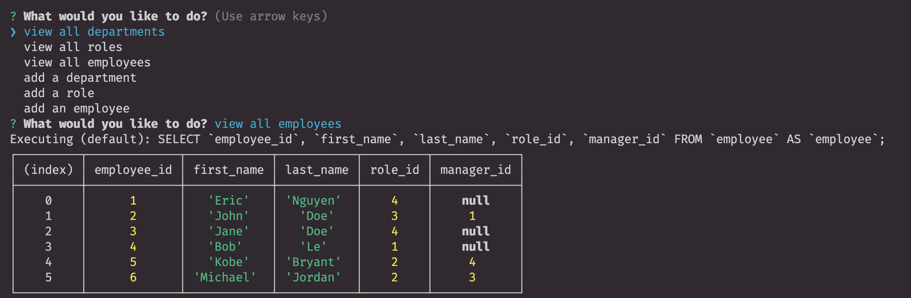

# Employee Tracker

## Description

This application gives a business owner a command line tool to check and take action on certain tables. It uses console.table to display a formatted table, inquirer for command line prompts and sequelize to help with sequel methods.

## Installation

- Clone this repo
- Run `npm i` to install dependencies

## Usage

- Run `npm start` in the terminal from the root folder to start the server
- Use the prompts from the terminal to proceed

## Video Link

[Video Demo](https://drive.google.com/file/d/1zYnUz8qN8O8VvvH6yh2nxcRBPaEBjADV/view)

### Screenshot of the project

## Credits

Eric Nguyen

## Questions

[Github Profile](https://github.com/ericnguyen23)

For any additional questions, please email me at ericnguyen23@gmail.com
